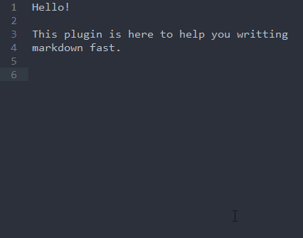

# Fast Markdown - Sublime Text Plugin

**Markdown**. You type some *markdown* all the time. For github, stackoverflow, your readmes, your docs, your blog posts. The list never stops. This is why I created this plugin. It's basically going to make you become faster at typing markdown

It auto insert prefixes in lists (`-`, `*`, `n.`). (reorganize automatically the numbers when you add/remove element). It support nested lists. 

It also helps with italics and bold (only working with `*` for now).

## A quick example



Sorry for the quality... :confused:

## Usage

The only thing you need to know is that when you want to insert an unordered nested list, just add at the end the line `- `. The `-` can be `+` or `*`. And if you want to insert an ordered list, add a `# `.

Otherwise, everything is just natural. :smirk:

## Install

For now, **Fast Markdown** is not available on Package Control, so you're going to install it manually.

## Using package control

No, I'm not crazy! You can install a package *with package control* from a github repo. [more info](https://packagecontrol.io/docs/usage). Here's what you have to do:

1. open up the command palette (`ctrl+shift+p`), and find `Package Control: Add Repository`. Then enter the URL of this repo: `https://github.com/math2001/fast-markdown` in the input field.
2. open up the command palette again and find `Package Control: Install Package`, and just search for `fast-markdown`.

The first step was just adding `fast-markdown` to the list of available plugin, and has it normally does, package control download the repo and convert it into a `.sublime-package` (just a `.zip` with the wrong extension)

## Using the command line

```
cd "%APPDATA%\Roaming\Sublime Text 3\Packages"     # on window
cd ~/Library/Application\ Support/Sublime\ Text\ 3 # on mac
cd ~/.config/sublime-text-3                        # on linux

git clone "https://github.com/math2001/fast-markdown"

Done!
```
